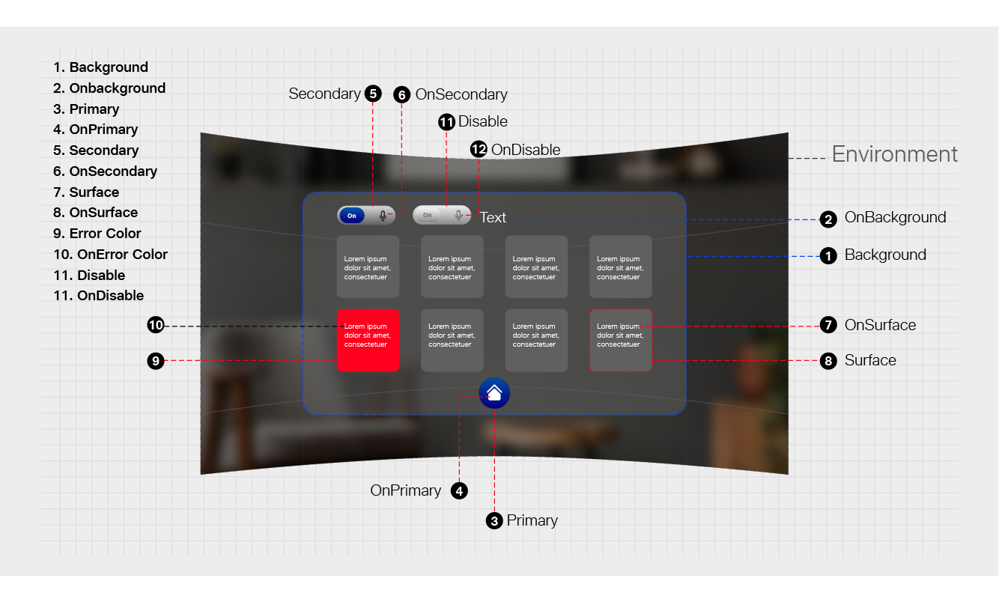
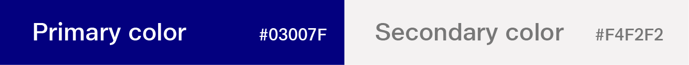
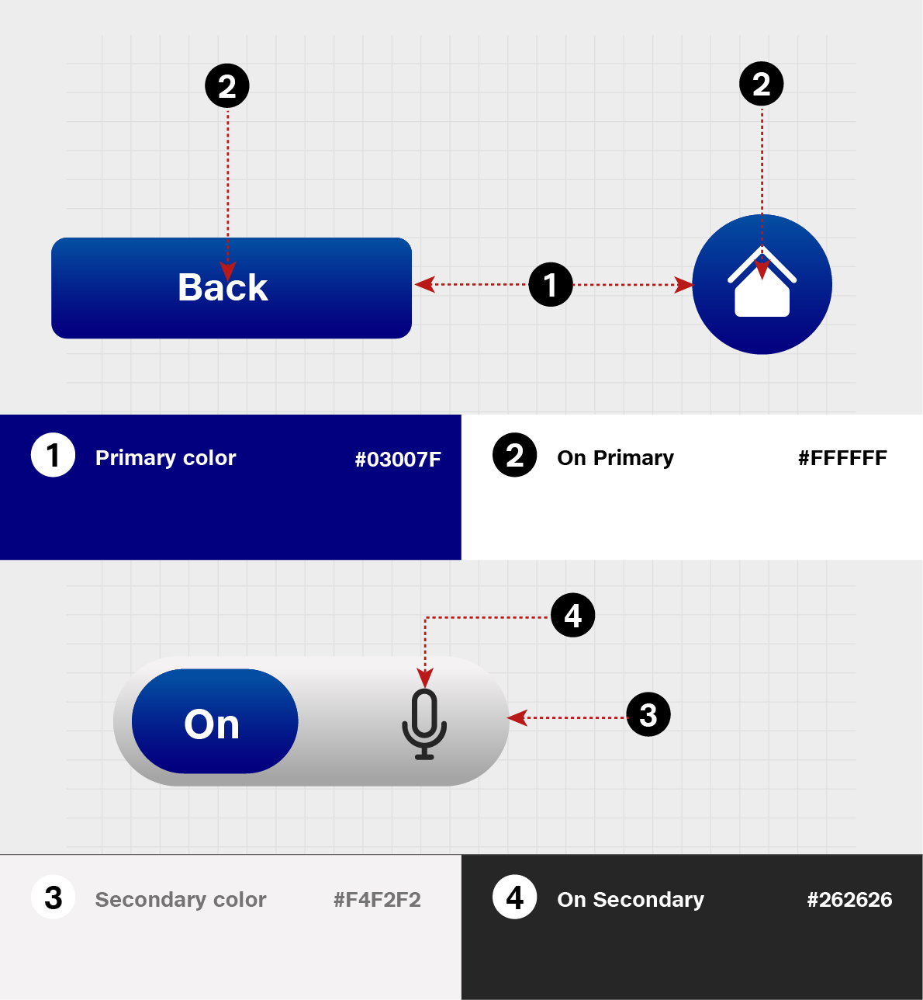
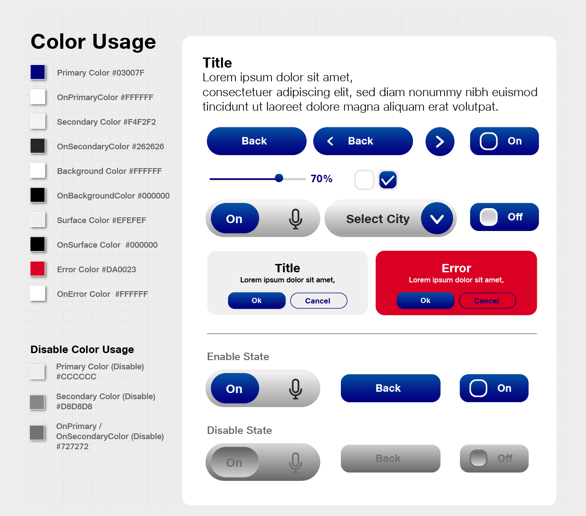
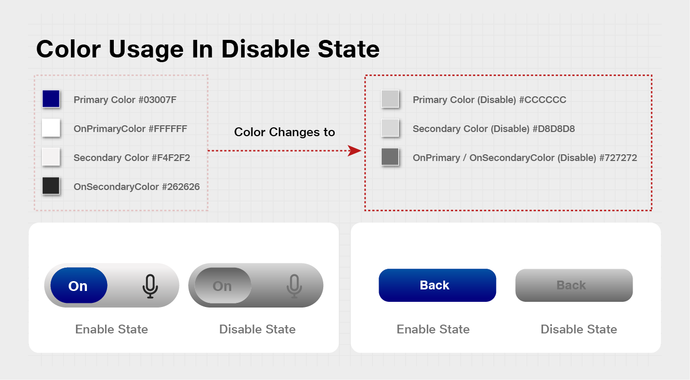

# Color System

Color provides an **intuitive way of communicating information** to users in your app, it can be used to indicate **interactivity, give feedback to user actions, and give your interface a sense of visual continuity.**

Colors are primarily determined by accent color and theme. Here we'll discuss how you can use color in your app, how to use accent color(Primary & Secondary color) and theme resources to make your app usable in any theme context.

## Best practices

| <ul><li><strong>Use color meaningfully.</strong>  When color is used sparingly to highlight important elements, it can help create a user interface that is fluid and intuitive.</li></ul>                                                       |
| --------------------------------------------------------------------------------------------------------------------------------------------------------------------------------------------------------------------------------------------------- |
| <ul><li><strong>Use color to indicate interactivity.</strong>  It's a good idea to choose one color to indicate elements of your application that are interactive. For example, many web pages use blue text to denote a hyperlink.</li></ul> |

## Defining the Color System in Tesseract Mixed Reality Design 

### Color Usage and Palette

1. Primary color
2. Secondary color

Primary and Secondary color mainly represent your brand to enhance your Interface in a consistent way.

### Color Theme

1. Primary color
2. Secondary color
3. Background Color
4. Surface Color
5. Error Color

All of these colors can be customized for your app.

### “on” Color”

When a color appears “on” top of a primary color, it’s called “on primary color.” They are labelled using the original color category (such as primary color) with the prefix “on.”\
This category of colors is called “on” colors.

* “On” Primary Color
* “On” Secondary Color
* “On” Background Color
* “On” Error Color

“On” colors are specifically applied to text, iconography, and strokes.


**Color Codes for Tesseract Mixed Reality Design**

Primary Color #03007F\
OnPrimaryColor #FFFFFF\
Secondary Color #f4f2f2\
OnSecondaryColor #262626\
Background Color #FFFFFF\
OnBackgroundColor #000000\
Surface Color #EFEFEF\
OnSurface Color #000000\
Error Color #DA0023\
OnError Color #FFFFFF


#### **Disabled Color**

\
A disabled state communicates a non-interactive component or element.


#### Color Codes

Primary Color (Disable)#cccccc\
Secondary Color (Disable)#d8d8d8\
OnPrimary/OnSecondaryColor (Disable) #727272

