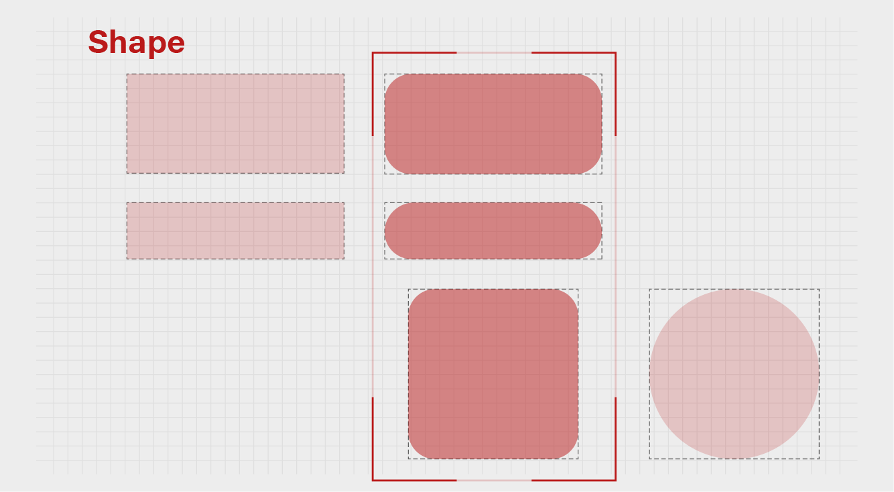
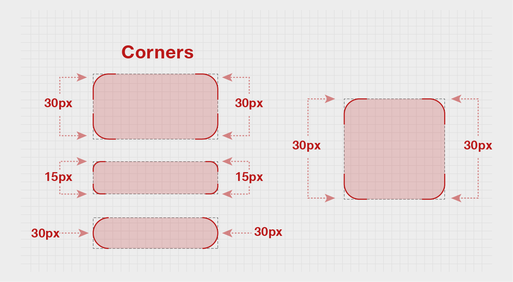
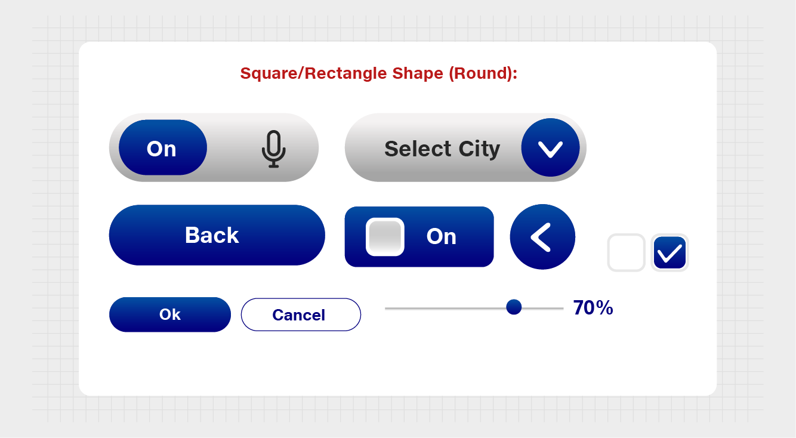

# Shape System

Shapes are a fundamental element that define the theme system.

Tesseract Mixed Reality Design uses **rounded curved edges style** for exuding simplicity and comfort.

The architecture should define an icon pack format that can be expanded later on to include more variations of design assets that can be loaded/changed during runtime.

## Layout

**Square/Rectangle Shape (Round):**\
Corner edges = 30px & 15px ( depending on the size of the shape on Display)

Eg.\
1\. If it is a **Button or Box-** 30 px corner is suggested.\
2\. If its a **Text box-** 15 px corner is suggested.

## Usage 

