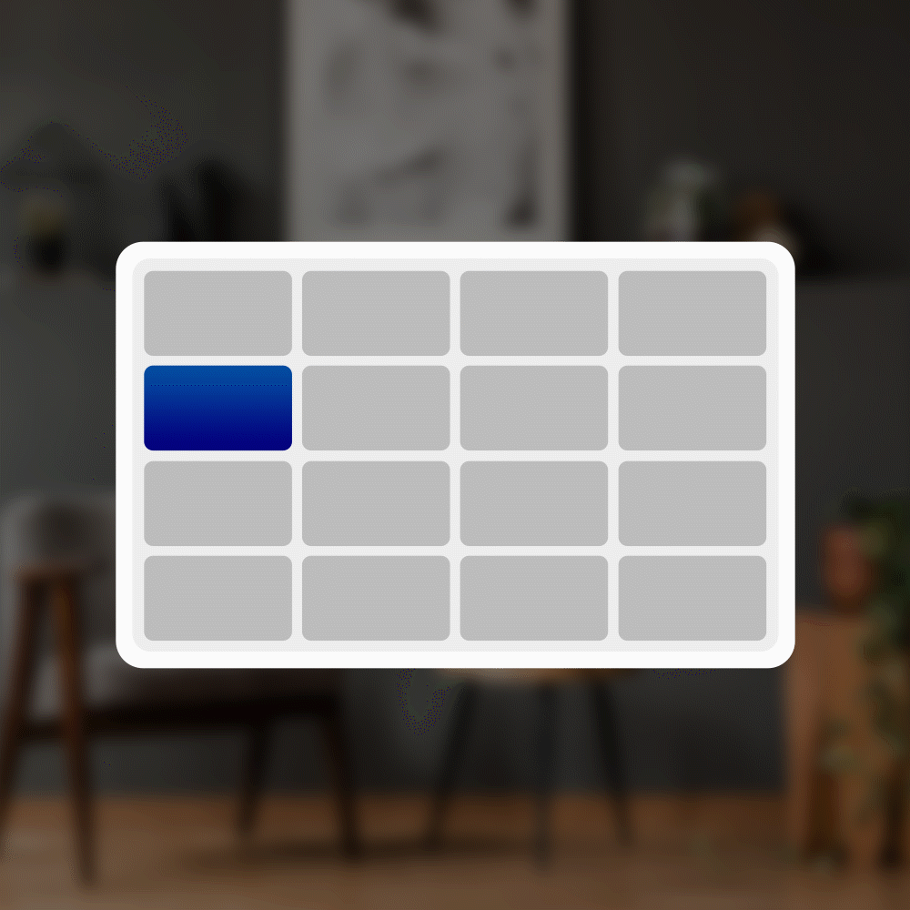

# Transition System

Transition system gives intelligent feedback based on the user's behavior, keeps the UI interactive, and guides the user through your app.

Motion helps make UI expressive and easy-to-use.

## Principles of Tesseract Mixed Reality Design for Transitions

|                                                                                                                                                                                                                                                                                                                                                                                                                                                                      |                                                                                                                                                                                                                                                 |
| -------------------------------------------------------------------------------------------------------------------------------------------------------------------------------------------------------------------------------------------------------------------------------------------------------------------------------------------------------------------------------------------------------------------------------------------------------------------- | ----------------------------------------------------------------------------------------------------------------------------------------------------------------------------------------------------------------------------------------------- |
| 
<strong>Functional</strong>

Motion serves a purpose with conviction. It guides the user through complexity and helps establish hierarchy. Movement gives the impression of enhanced performance and optimizes the user experience by hiding perceived latency.

Page transitions are purpose-built. They give hints about how pages are related to each other. They move in a manner that's perceived faster even when performance is not optimal.
 | 

                                                                                                                                             |
| 
<strong>Continuous</strong>

Movement from point to point naturally draws the eye and guides the user. It elegantly stitches together a user’s task, making it feel optimal and user-friendly.

Objects can travel from scene to scene or morph within a scene to provide continuity and help the user maintain context.
                                                                                                                            | 

 |
| 
<strong>Contextual</strong>

Intelligent motion provides feedback to the user in a manner that's aligned with how they manipulated the UI. Interaction is centered around the user. The movement feels appropriate to the form-factor and designed around the scenario. It should be comfortable for each user.

Animation should tie back to the user interaction. A Context Input Field is deployed from a point where the user activates it.
     | 

 |

## Motion Articles 

| Concept               | Representative Illustration                                                                                                                                                                                                                     |
| --------------------- | ----------------------------------------------------------------------------------------------------------------------------------------------------------------------------------------------------------------------------------------------- |
| Timing and ease       | 

 |
| Direction and gravity |                                                                                                                                                                                                          |
| Page transitions      |                                                                                                                                                                                                          |
| Connected animation   |                                                                                                                                                                                                          |
