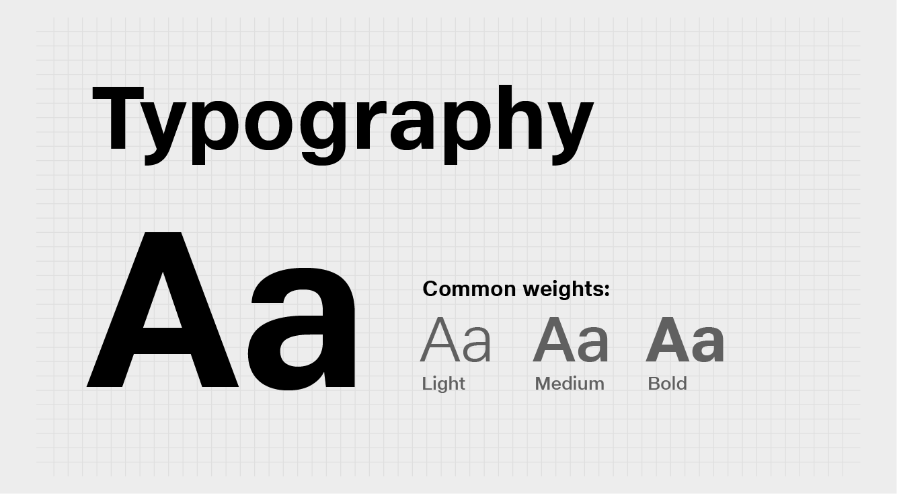
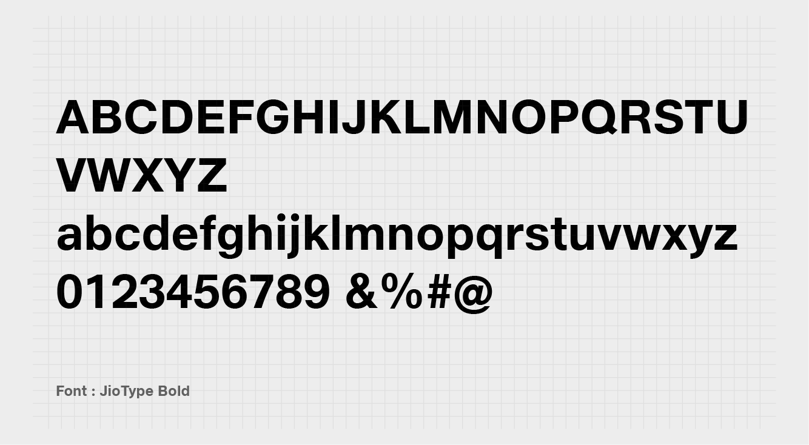
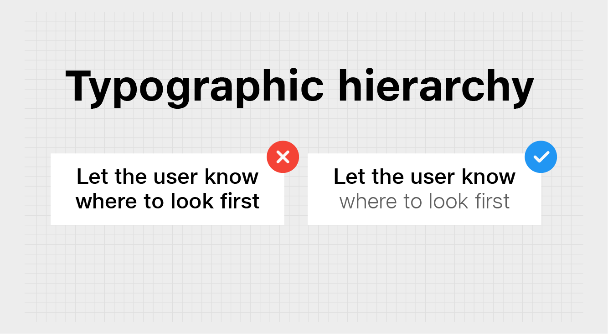
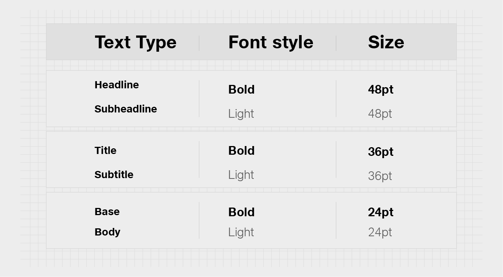
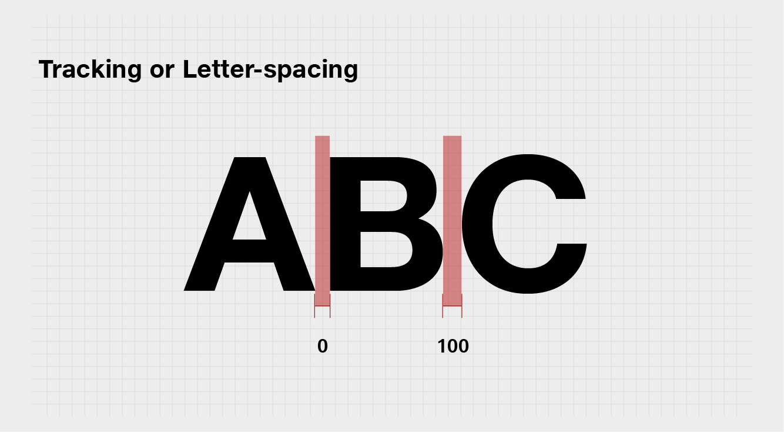
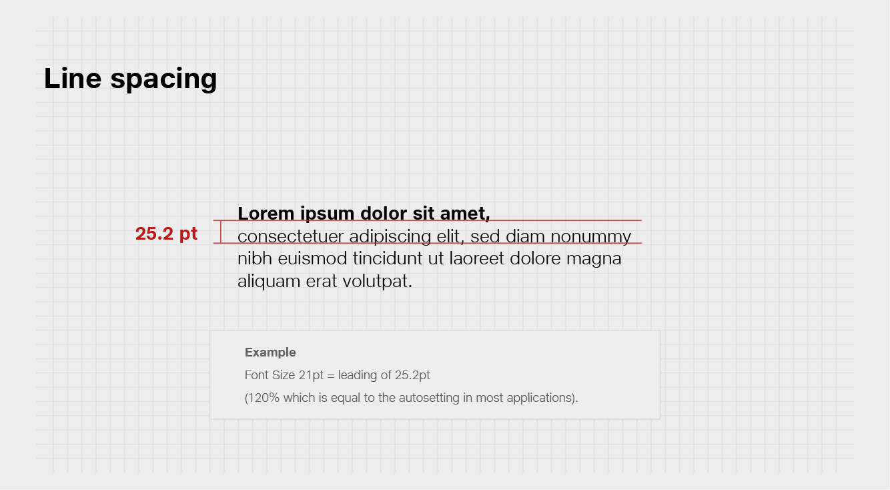
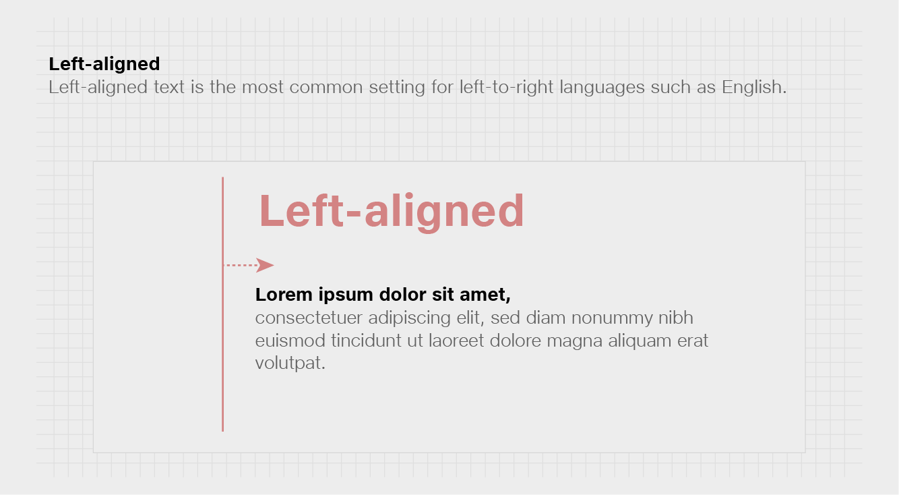
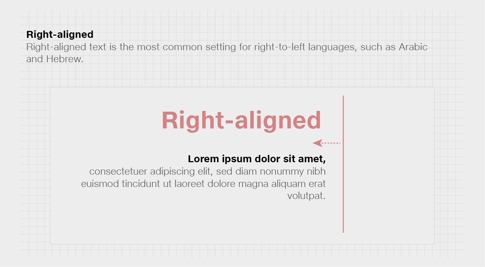
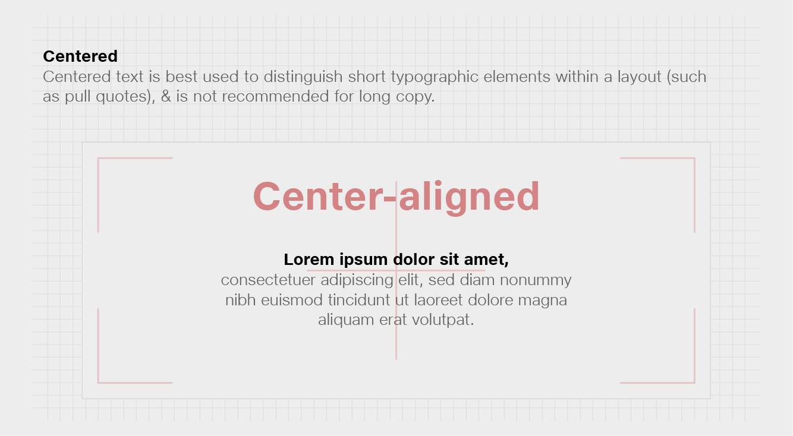

# Typography

As the visual representation of language, the typography’s main task is to communicate information. Its style should never get in the way of that goal. Here we'll discuss how to style typography in your Windows app to help users understand content easily and efficiently.

## Best practices 

Use one font throughout your app's UI, and we recommend sticking with the default font for Windows apps, **JioType**. It's designed to maintain optimal legibility across sizes and pixel densities and offers a clean, light, and open aesthetic that complements the content of the system.

| **Do's**                   | **Don’t**                 |
| -------------------------- | ------------------------- |
| Pick one font for your UI. | Don't mix multiple fonts. |

### Layout

### Typographic hierarchy

Users rely on visual hierarchy when scanning a page: headers summarize content, and body text provides more detail. To create a clear visual hierarchy in your app, follow the type ramp.

### Type Ramp

Type ramp establishes crucial relationships between the type styles on a page, helping users read content easily.

## Content 

Tesseract and ‘Digital Life’ cannot be translated in any other language. For all other content we speak in 12 regional Indian languages in addition to English. These include Hindi, Marathi, Gujarati, Bengali, Oriya, Assamese, Punjabi, Tamil, Telugu, Kannada, Malayalam and Urdu.

We use the Shree Lipi 7.1 font family as our regional typeface.

### Tracking or Letter-spacing 

**Letter-spacing**, also called tracking, refers to the uniform adjustment of the space between letters in a piece of text.

Use tracking between 0 - 10. For long text, it is advisable to adjust the tracking to 10 to increase readability. Ensure that letters never touch each other in a headline or subhead text. See the chart at the right for tracking guidelines.

### Line spacing 

Line spacing (Leading) describes the space between the text baselines. See the chart at the right for line spacing guidelines.

### Type alignment 

Type alignment controls how text aligns in the space it appears. There are three type alignments:

* Left-aligned: when text is aligned to the left margin
* Right-aligned: when text is aligned to the right margin
* Centered: when text is aligned to the center of the area it is set in


Alignment: The default Text Alignment is Left, and in most instances, flush-left and ragged right provides consistent anchoring of the content and a uniform layout.


### Character count 

| **Do’s**                                             | **Don’t**                                                                         |
| ---------------------------------------------------- | --------------------------------------------------------------------------------- |
| Stick to 50–60 letters per line for ease of reading. | Less than 20 characters or more than 60 characters per line is difficult to read. |
