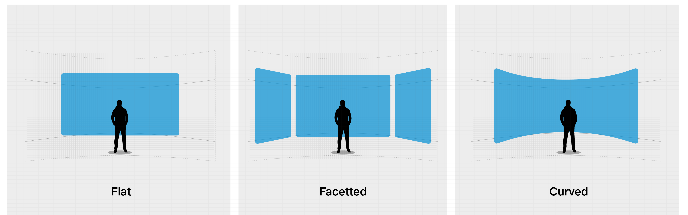

# User Interfaces in Mixed Reality

In Mixed Reality, the most common forms of User Interfaces are either _flat_, _faceted or_ _curved._&#x200B;

* **Curved UI** looks sleeker and more futuristic.​
* Jio recommends using **Curved** UI wherever possible.

